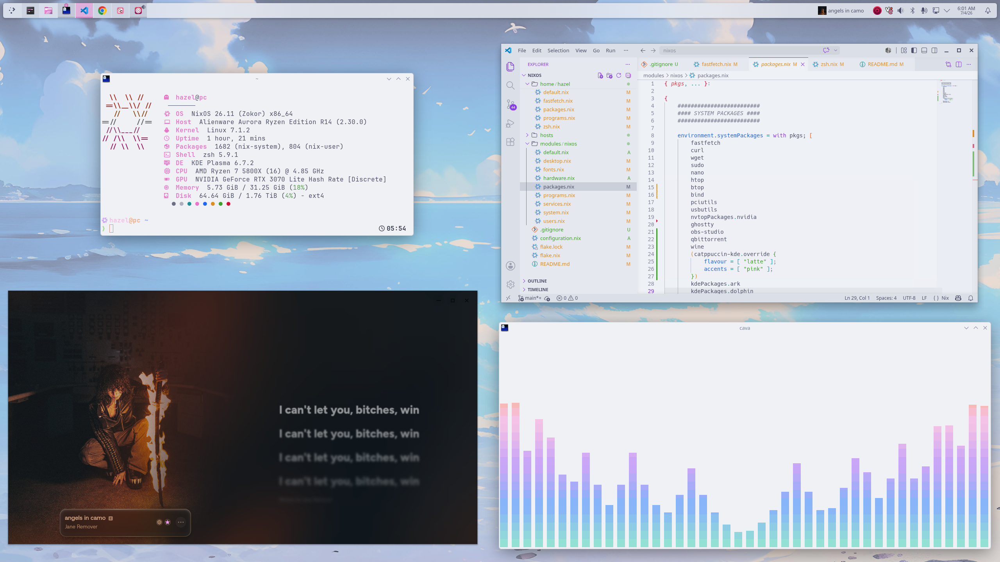
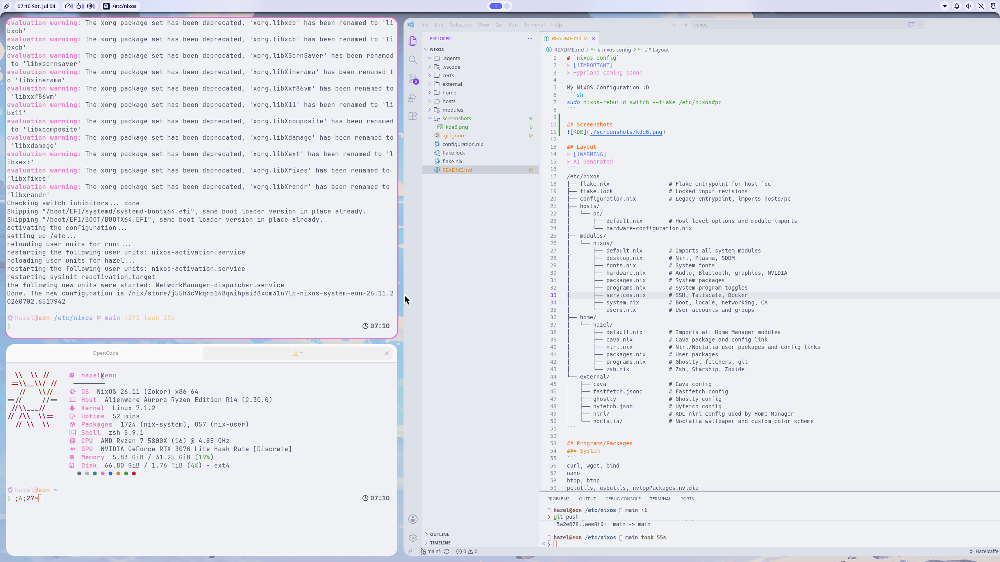

# `nixos-config`
My NixOS Configuration :D
```sh
sudo nixos-rebuild switch --flake /etc/nixos#pc-kde
sudo nixos-rebuild switch --flake /etc/nixos#pc-niri
```

## Screenshots
### KDE

### Niri


## TODO
- Fonts... Fix the fonts... Different fonts...
- QEMU/VM stuff
- VNC/RDP
- Firewall
- Hyprland (Modded https://github.com/lwilk0/1882-dots)
